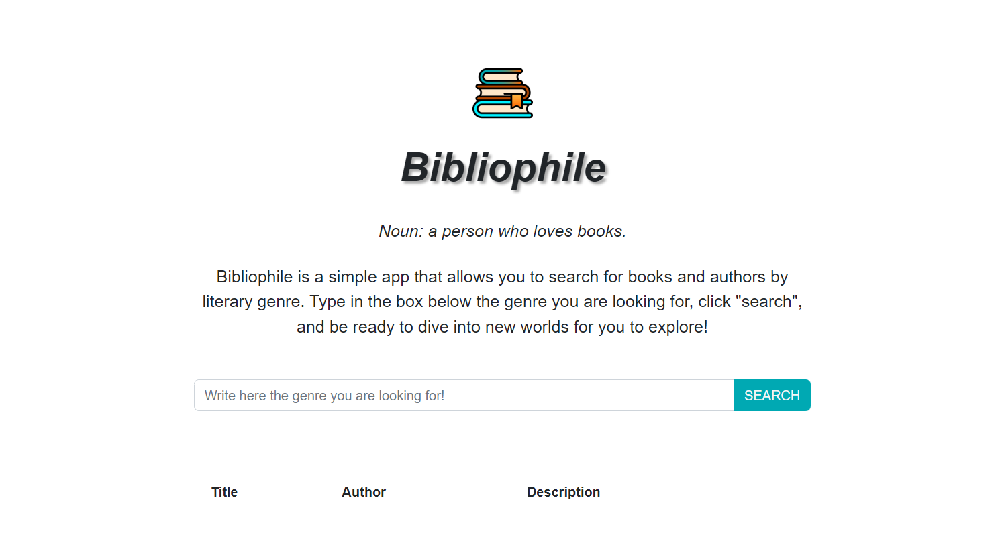

# Bibliophile

The project shown here is a simple app, developed with HTML, CSS and JavaScript, and the use of Bootstrap 5.3. This project does not need to be installed; to test it locally, simply download the source code and open the index.html file in your browser.

The interface of the app consists of a search bar, through which one can search for a literary genre, obtaining a set of titles and their authors.

By clicking on a title or author, you get a description of the book.

The APIs used can be found at this link: <https://openlibrary.org/developers/api>
